<p style="text-align: center; font-size: x-large;"> Drought stress in the Amazon rainforest </p>

<p style="text-align: center; font-size: large;"> An evaluation of different drought metrics and datasets </p>

<p style="text-align: center; font-size: medium;"> The code behind </p>

#Preparation


```r
library(SPEI)
library(tidyverse)
library(ncdf4)
library(lubridate)
library(regmap)
library(ggpubr)
library(cowplot)
library(GGally)
library(corrplot)
library(gridExtra)
library(pcaPP)
```

## Functions


```r
# CWD with the fixed value of 100 mm month PET ----
cwd <- function(x, clim_year_start = 1, et = 100) {
  x <- x %>% 
    arrange(year, month) %>% 
    # compute precipitation of previous month
    mutate(prev_prec = lag(monthly_prec, default = 0))
  
  # restrict to complete year for easier blocking
  if (x$month[1] != 1) {
    n <- nrow(x)
    x <- x[which(x$month == 1)[1]:n, ]
  }
  if (tail(x$month, 1) != 12) {
    n <- nrow(x)
    x <- x[1:tail(which(x$month == 12), 1), ]
  }
  
  # create potentially altered year cycle for climatological year
  clim_year_months <- c(1:12)
  if (clim_year_start != 1) {
    clim_year_months <- clim_year_months[c(clim_year_start:12, 1:(clim_year_start - 1))]  
  }
  
  # loop in month-wise blocks
  for (i in 1:12) {
    .month <- clim_year_months[i]
    .prev_month <- clim_year_months[i - 1]
    if (.month == 1) {
      x$wd[x$month == .month] <- 0
    } else {
      wd0 <- x$wd[x$month == .prev_month] - et + x$monthly_prec[x$month == .month]
      x$wd[x$month == .month] <- ifelse(wd0 >= 0, 0, wd0)
    }
  }
  x
}


# Tidy TRMM data ----
ncdf_to_tidy <- function(nc, .var, .start, .time = "time",
                         .res = "1 day", .station = "station",
                         .lon = "lon", .lat = "lat") {
  time <- ncvar_get(nc, .time)
  time <- seq(as.Date(.start), by = .res, length.out = length(time))
  year <- year(time) %>% as.integer
  month <- month(time) %>% as.integer
  day <- day(time)
  
  var_tidy <- ncvar_get(nc, .var) %>%
    as_tibble %>%
    mutate(year = year,
           month = month,
           day = day) %>%
    gather(station, .var, starts_with("V"))
  
  landid <- tibble(station = ncvar_get(nc, .station),
                   lon = ncvar_get(nc, .lon),
                   lat = ncvar_get(nc, .lat)) %>%
    mutate(station = paste0("V", station + 1))
  
  left_join(var_tidy, landid, by = "station") %>%
    dplyr::select(lon, lat, year, month, day, .var)
}

# Refine resolution for datasets that have a more coarse one ----

refineResolution <- function(data, .var = ""){
  #a move of 0.5 degree is apllied to any of the following directions so that the each cell's resolution is refined
  east <- data
  north <- data
  northEast <- data
  
  east$lon <- east$lon + 0.5
  north$lat <- north$lat + 0.5
  northEast$lon <- east$lon
  northEast$lat <- north$lat
  
  refinedData <- data %>% 
    rbind(east) %>%
    rbind(north) %>%
    rbind(northEast)
  refinedData <- refinedData %>% arrange(lon, lat, year, month)
  return(refinedData)
}

# Crop a tibble in order to contain only Amazon relevant pixels ----
cropTibbleToAmazonExtent <- function(tableToBeCropped){
  
  #We use the TRMM extent as guidence
  lonTrmm <- ncvar_get(trmm, "lon")
  latTrmm <- ncvar_get(trmm, "lat")
  
  lonLatFromTRMM <- paste(as.character(lonTrmm), " ", as.character(latTrmm))
  
  tableToBeCropped <- tableToBeCropped %>% 
    mutate(coor = paste(as.character(lon), " ", as.character(lat))) %>%
    group_by(coor) %>%
    mutate(cellStays =  coor %in% lonLatFromTRMM) %>%
    filter(cellStays == TRUE) %>%
    ungroup() %>%
    mutate(stays = (!(lon == -76 & lat == -12.0))) %>%
    filter(stays == TRUE) %>%
    dplyr::select(-cellStays, -stays, -coor) %>%
    arrange(lon, lat, year, month)
  
  #We exclude the -76, -12 pixel because of its NA values
  
  return(tableToBeCropped)
}

# Reading in various relevant for the analysis ncdf files (PET, AET, SPEI data). A rectangle following Amazon shape is extracted initially ----
readFromNcFile <- function(ncfile, .var="", .lon = "lon", .lat = "lat", moreDims = FALSE){
  time <- ncvar_get(ncfile, "time")
  lon <- ncvar_get(ncfile, .lon)
  lat <- ncvar_get(ncfile, .lat)
  date <- 0
  #used for spei only
  correctionInDegrees <- 0
  
  #the values are the max min for both longitute and laditude - respectively
  lons <- seq(-79.5, -50.5, by= 1)
  lats <- seq(-20.5, 4.5, by = 1)
  
  if (.var == "ET_mean")
  {
    date <- as.Date(paste(as.character(time),as.character(01)), format = "%Y%m%d")
  }
  if(.var %in% c("spei", "pre", "pet")) #pre and pet refer to the CRU data
  {
    time0 <- ymd("1900-01-01")
    date <- time0 + days(time)
    correctionInDegrees <- 0.25
    lons <- seq(-79.5, -50.5, by= 0.5)
    lats <- seq(-20.5, 4.5, by = 0.5)
  }
  if (.var == "pe")
  {
    time0 <- ymd("1948-01-01")
    date <- time0 + months(time)
    lon[181:360] <- seq(from = -179.5, to = -0.5, by = 1)
  }
  
  grid <- expand.grid(lon = lons, lat = lats)
  
  #Getting the data from the NetCDF-------------------------------------------------------
  extractedData <- tibble()
  
  for (i in 1:nrow(grid)){
    amazon_lon_index <- which(lon == grid$lon[i] - correctionInDegrees)
    amazon_lat_index <- which(lat == grid$lat[i] - correctionInDegrees)
    
    #PE has one more dimension which needs to be taken care of
    startVector <- c(amazon_lon_index, amazon_lat_index, 1)
    countVector <- c(1, 1, -1)
    
    if(moreDims)
    {
      startVector <- c(amazon_lon_index, amazon_lat_index, 1, 1)
      countVector <- c(1, 1, 1, -1)
    }
    
    value <- ncvar_get(ncfile, .var,
                       start = startVector,
                       count = countVector) ####gives NA values
    singleRow <- tibble(value, date) %>% mutate(
      year = year(date),
      month = month(date),
      lon = grid$lon[i],
      lat = grid$lat[i]
    )
    extractedData <- extractedData %>% rbind(singleRow)
  }
  
  return(extractedData)
}

# compute Cwd with input from various metrices ----
computeCwd <- function(x, cwdList) {
  x <- x %>%
    group_by(lon, lat) %>%
    mutate(record_number = row_number(lon)) %>%
    ungroup() %>%
    arrange(lon, lat, year, month)
  
  for (cwdId in 1:length(cwdList)) {
    cwd <- cwdList[cwdId]
    cwdElements <- strsplit(cwd, "_") # e.g. "cwd" "preCru" "petCruAvg" "r"
    if (cwdElements[[1]][2] == "aet") {
      petVar <- cwdElements[[1]][3] # variation of the pet data - Princeton/CRU
      for (month in 1:12) {
        relevantRows <- x$month == month
        if(month == 1){
          wd <- x$aet[relevantRows] - x[relevantRows, petVar]
          wdNegative <- sapply(wd, function (value) ifelse(value >= 0, 0, value))
          x[relevantRows, cwd] <- wdNegative
        }
        else{
          prev_cwd_value <- x[x$month == month - 1, cwd]
          wd <- prev_cwd_value + x$aet[relevantRows] - x[relevantRows, petVar]
          wdNegative <- sapply(wd, function (value) ifelse(value >= 0, 0, value))
          x[relevantRows, cwd] <- wdNegative
        }
      }
    }
    else {
      prec <- cwdElements[[1]][2]
      etMetric <- cwdElements[[1]][3]
      isReset <- cwdElements[[1]][4] == "r"
      loops<- 96 #in case no resetting is applied; 8 * 12 because of the 8 year period
      
      if (isReset) {
        loops <- 12
      }
      
      for (position in 1:loops) {
        relevantRows <- 0
        
        if (isReset) {
          relevantRows <- x$month == position
        }
        else {
          relevantRows <- x$record_number == position
        }
        
        if (position == 1) {
          wd <- x[relevantRows, prec]  - x[relevantRows, etMetric]
          wdNegative <- sapply(wd, function (value) ifelse(value >= 0, 0, value))
          x[relevantRows, cwd] <- wdNegative
        }
        else {
          prev_cwd_value <- 0
          if (isReset) {
            prev_cwd_value <- x[x$month == position - 1, cwd]
          }
          else{
            prev_cwd_value <- x[x$record_number == position - 1, cwd]
          }
          
          wd <- prev_cwd_value - x[relevantRows, etMetric] + x[relevantRows, prec]
          wdNegative <- sapply(wd, function (value) ifelse(value >= 0, 0, value))
          x[relevantRows, cwd] <- wdNegative
        }
      }
    }
  }
  return(x %>% dplyr::select(-record_number, -et100))
}

# compute MCWD (based on cwd) and anomalies ----
computeMcwdAndAnomalies <- function(data, anoInScope = tibble(), anoSdInScope = tibble(), var = "")
{
  data %>% 
    group_by(lon, lat, year) %>%
    summarise(mcwd = round(min(!!as.name(var)))) -> mcwd
  
  mcwd %>% 
    group_by(lon, lat) %>%
    summarise(mcwdMean = round(mean(mcwd)), mcwdSd = round(sd(mcwd))) -> mcwd_avg
  
  mcwd%>% 
    left_join(mcwd_avg, by = c("lon", "lat")) %>% 
    mutate(mcwd_diff = mcwd - mcwdMean, mcwd_diff_sd = ifelse(mcwdSd == 0, 0, (mcwd - mcwdMean)/mcwdSd)) -> anomaly
  
  if(ncol(anoInScope) < 1)
  {
    anoInScope <- anomaly %>%
      ungroup %>%
      select(year, lon, lat, mcwd_diff)
  }
  else
  {
    anoInScope <- anoInScope %>% add_column(anomaly$mcwd_diff)
  }
  
  if(ncol(anoSdInScope) < 1)
  {
    anoSdInScope <- anomaly %>%
      ungroup %>%
      select(year, lon, lat, mcwd_diff_sd)
  }
  else
  {
    anoSdInScope <- anoSdInScope %>% add_column(anomaly$mcwd_diff_sd)
  }
  
  colnames(anoInScope)[ncol(anoInScope)] <- substring(var, 5, nchar(var))
  colnames(anoSdInScope)[ncol(anoSdInScope)] <- substring(var, 5, nchar(var))
  
  data %>% 
    group_by(lon, lat, month) %>%
    summarise(mcwdMeanByMonth = mean((!!as.name(var))), mcwdSdByMonth = sd((!!as.name(var)))) -> mcwd_monthly_avg
  #return(mcwd_monthly_avg)
  
  colName <- paste(var, "_monthlySd", sep = "")
  data <- data %>% 
    left_join(mcwd_monthly_avg, by = c("month", "lon", "lat")) %>%
    mutate(!!colName := ifelse(mcwdSdByMonth == 0, 0, ((!!as.name(var)) - mcwdMeanByMonth)/mcwdSdByMonth)) %>%
    dplyr::select(-mcwdSdByMonth, -mcwdMeanByMonth)
  
  returnedList <- list("AmazonWD" = data, "anomalies" = anoInScope, "anomaliesSd" = anoSdInScope)
  return(returnedList)
}
```

## Loading TRMM precipitation data


```r
# TRMM Data loading ----
trmm <- nc_open("TRMM_Amazon_1998_April_2017.nc")

trmm_tidy <- ncdf_to_tidy(trmm, .var = "prec", .start = "1998-01-01")

monthly_trmm <- trmm_tidy %>%
  group_by(year, month, lon, lat) %>%
  summarise(monthly_prec = sum(.var))

rm("trmm_tidy")

# introducing record_number for the purpose of ordering
monthly_trmm <- monthly_trmm %>%
  group_by(lon, lat) %>%
  mutate(record_number = row_number(lon))

# introducing station_id for the purpose of ordering
monthly_trmm <- monthly_trmm %>%
  group_by(year, month) %>%
  mutate(station_id = row_number(year))

# ordering
monthly_trmm <- monthly_trmm %>%
  arrange(station_id, record_number)

speiComputed <- monthly_trmm %>%
  mutate(stays = (!(lon == -76 & lat == -12.0))) %>%
  filter(stays == TRUE) %>%
  dplyr::select(-stays, -record_number, -station_id) %>%
  filter(year > 1997 & year < 2009) %>%
  arrange(lon, lat, year, month)

colnames(speiComputed)[ncol(speiComputed)] <- "pre" 

#Cumulative water deficit
trmm_cwd <- monthly_trmm %>% 
  mutate(wd = NA) %>% 
  group_by(station_id) %>% 
  nest() %>% 
  mutate(cwd_df = purrr::map(data, cwd)) %>% 
  unnest(cwd_df)
```

## Loading LandFlux EVAL AET data


```r
et_raw <- nc_open("LandFluxEVAL.merged.89-05.monthly.all.nc")
amazon_et <- readFromNcFile(et_raw, "ET_mean")
rm("et_raw")

#Going from daily to monthly ET and mean values computation-----------------------------
amazon_et <- amazon_et %>%
  filter(year %in% 1998:2005) %>%
  mutate(daysInMonth = days_in_month(date), aet = daysInMonth*value) %>%
  dplyr::select(-value, -date, -daysInMonth)

amazon_et <- refineResolution(amazon_et, "totalEt")
amazon_et <- cropTibbleToAmazonExtent(amazon_et)
amazon_et$aet<-round(as.numeric(amazon_et$aet), 3)
```

## Loading Princeton University PET data


```r
ncfile <- nc_open("pe_penman_rnet_empirical_monthly_1948-2008.nc")

pe <- readFromNcFile(ncfile, "pe", "longitude", "latitude", moreDims = TRUE)

petForSpei <- pe %>%
  filter(year > 1997) %>%
  mutate(daysInMonth = days_in_month(date)) %>%
  mutate(pet = value*daysInMonth) %>%
  dplyr::select(-daysInMonth, -value, -date)

pe <- pe %>%
  filter(year %in% 1998:2005) %>%
  mutate(daysInMonth = days_in_month(date)) %>%
  mutate(pet = value*daysInMonth) %>%
  dplyr::select(-daysInMonth, -value, -date)

pe <- refineResolution(pe, "pe")
petForSpei <- refineResolution(petForSpei, "pe")

pe <- cropTibbleToAmazonExtent(pe)
petForSpei <- cropTibbleToAmazonExtent(petForSpei) %>%
  arrange(lon, lat, year, month)

speiComputed <- add_column(speiComputed, pet = petForSpei$pet)
rm("petForSpei", 'ncfile')
```

## Loading CRU PET and precipitation data


```r
dir(pattern = ".nc")
```

```
##  [1] "cru_ts4.01.1901.2016.pet.dat.nc"              
##  [2] "cru_ts4.01.1901.2016.pre.dat.nc"              
##  [3] "cruIncluded"                                  
##  [4] "Functions.R"                                  
##  [5] "LandFluxEVAL.merged.89-05.monthly.all.nc"     
##  [6] "pe_penman_rnet_empirical_monthly_1948-2008.nc"
##  [7] "PrincetonPetLoading.R"                        
##  [8] "spei01.nc"                                    
##  [9] "spei03.nc"                                    
## [10] "TRMM_Amazon_1998_April_2017.nc"
```

```r
cruPreNc <- nc_open("cru_ts4.01.1901.2016.pre.dat.nc")
cruPetNc <- nc_open("cru_ts4.01.1901.2016.pet.dat.nc")

cruPre <- readFromNcFile(cruPreNc, "pre")
cruPre <- cruPre %>%
  filter(year %in% 1998:2005)
cruPre <- cropTibbleToAmazonExtent(cruPre)

cruPet <- readFromNcFile(cruPetNc, "pet")
cruPet <- cruPet %>%
  filter(year %in% 1998:2005)
cruPet <- cropTibbleToAmazonExtent(cruPet)

speiCruComputed <- cruPre %>%
  arrange(lat, lon, year, month) %>%
  select(-date, pre = value)

speiCruComputed <- cbind(speiCruComputed, cruPet %>%
  arrange(lat, lon, year, month) %>%
  mutate(pet = days_in_month(date) * value) %>%
  select(pet))

rm('cruPreNc', 'cruPetNc', 'cruPre', 'cruPet')
```

## Computing SPEI and SPI


```r
source('tidyspei.R')

speiComputed <- speiComputed %>%
  group_by(lat, lon) %>%
  arrange(year, month) %>%
  nest() %>%
  mutate(
    spei3 = purrr::map(data, tidyspei, scale = 3),
    spi3 = purrr::map(data, tidyspei, scale = 3, mode = "spi")
  ) %>%
  unnest(data, spei3, spi3)

speiComputed <- speiComputed %>%
  arrange(lon, lat, year, month) %>%
  filter(year > 1997 & year < 2006)

#sapply(speiComputed, function(x){sum(is.infinite(x))})
#there are 7 Inf values of SPEI
speiComputed$spei3[speiComputed$spei3 %in% c(Inf, -Inf)] <- NA

#sapply(speiComputed, function(x){sum(is.na(x))})
#SPEI 3993, SPI 4049

#CRU
speiCruComputed <- speiCruComputed %>%
  group_by(lat, lon) %>%
  arrange(year, month) %>%
  nest() %>%
  mutate(
    spei3 = purrr::map(data, tidyspei, scale = 3),
    spi3 = purrr::map(data, tidyspei, scale = 3, mode = "spi")
  ) %>%
  unnest(data, spei3, spi3)

speiCruComputed <- speiCruComputed %>%
  arrange(lon, lat, year, month) %>%
  filter(year %in% 1998:2005)

#sapply(speiCruComputed, function(x){sum(is.infinite(x))})
#there are 97 Inf values of SPEI
speiCruComputed$spei3[speiCruComputed$spei3 %in% c(Inf, -Inf)] <- NA

#sapply(speiCruComputed, function(x){sum(is.na(x))})
#unreasonably high number of NA values epsecially with SPI - 22378, SPEI - 9987
#input data is checked - no NA value present there
```

## Compile the data ina single tibble


```r
amazonPREC <- monthly_trmm %>%
  filter(year > 1997 & year < 2006) %>%
  select(-station_id, -record_number) %>%
  mutate(stays = (!(lon == -76 & lat == -12.0)),
         preTrmm = monthly_prec) %>%
  filter(stays == TRUE) %>%
  arrange(lon, lat, year, month)%>%
  select(-stays, -monthly_prec)

amazon98_05meanET <- amazon_et %>%
  group_by(lon,lat, month) %>%
  mutate(meanET = mean(aet))

amazonWD <- add_column(amazonPREC, aet = amazon_et$aet)
amazonWD <- add_column(amazonWD, preCru = speiCruComputed$pre)
amazonWD <- add_column(amazonWD, aetAvg = amazon98_05meanET$meanET)
amazonWD <- add_column(amazonWD, pet = pe$pet)
amazonWD <- add_column(amazonWD, petCru = speiCruComputed$pet)
rm("amazonPREC", "amazon98_05meanET", "amazon_et")

amazonWD <- amazonWD %>%
  group_by(lon, lat, month) %>%
  mutate(et100 = 100, petAvg = mean(pet), petCruAvg = mean(petCru)) %>%
  arrange(lon, lat, year, month)

# Computing CWD --------------------------
amazonWD <- amazonWD %>%
  mutate(cwd_preTrmm_et100_r = as.double(NA),
         cwd_preTrmm_aet_r = as.double(NA),
         cwd_preTrmm_aetAvg_r = as.double(NA),
         cwd_preTrmm_pet_r = as.double(NA),
         cwd_preTrmm_petAvg_r = as.double(NA),
         cwd_preTrmm_pet_nr = as.double(NA),
         cwd_preTrmm_petAvg_nr = as.double(NA),
         cwd_aet_pet_r = as.double(NA),
         cwd_preCru_et100_r = as.double(NA),
         cwd_preCru_aet_r = as.double(NA),
         cwd_preCru_aetAvg_r = as.double(NA),
         cwd_preCru_petCru_r = as.double(NA),
         cwd_preCru_petCruAvg_r = as.double(NA),
         cwd_preCru_petCru_nr = as.double(NA),
         cwd_preCru_petCruAvg_nr = as.double(NA),
         cwd_aet_petCru_r = as.double(NA))

cwdVector <- colnames(amazonWD[14:ncol(amazonWD)])

amazonWD <- computeCwd(amazonWD, cwdVector)

amazonWD <- cbind(amazonWD, speiTrmm03 = speiComputed$spei3, spiTrmm03 = speiComputed$spi3)
amazonWD <- cbind(amazonWD, speiCru03 = speiCruComputed$spei3, spiCru03 = speiCruComputed$spi3)

amazonWD <- amazonWD %>%
  mutate(season = ifelse(month %in% c(4:9), "dry", "wet"))
```

## Compute the MCWD monthly and annual anomalies

```r
anomalies <- tibble()
anomaliesSd <- tibble()

for (cwd in 1:length(cwdVector)) {
  result <- computeMcwdAndAnomalies(amazonWD, anomalies, anomaliesSd, cwdVector[cwd])
  amazonWD <- result [[1]]
  anomalies <- result[[2]]
  anomaliesSd <- result[[3]]
}

anomalies <- anomalies %>%
  arrange(lon, lat, year)

anomaliesSd <- anomaliesSd %>%
  arrange(lon, lat, year)

amazonWD <- amazonWD %>%
  arrange(lon, lat, year, month)
```

# Plots

## Description of study area


```r
#dry months count
drySeasonLengthPlot <- monthly_trmm %>%
  filter(year %in% 1998:2005) %>%
  group_by(lon, lat, year) %>%
  summarise(seasonLength = sum(monthly_prec < 100)) %>%
  regmap(region = "ama") +
  geom_tile(aes(x = lon, y = lat, fill = seasonLength)) +
  scale_fill_gradient2(low="darkgreen", midpoint = 5, mid = "yellow", high = "red", name="Dry months", 
                      labels = c(12:0),
                      breaks = c(12:0)) +
  theme(axis.title.x = element_blank(),
        axis.title.y = element_blank(),
        legend.position = "bottom",
        legend.direction = "horizontal",
        legend.key.width = unit(1.6, "cm"))

annualPrecipitation <- monthly_trmm %>%
  filter(year %in% 1998:2005) %>%
  group_by(lon, lat, year) %>%
  summarise(annualPrec = sum(monthly_prec))

annualPrecipitation$labelPrec <- cut(
  annualPrecipitation$annualPrec,
  breaks = c(seq(0, 2800, by = 400), max(annualPrecipitation$annualPrec)),
  labels = c("0 - 400", "400-800", "800 - 1200", "1200 - 1600", "1600 - 2000", "2000 - 2400", "2400 - 2800", "2800 <"),
  right  = FALSE,
  include.lowest = TRUE)

annualPrecPlot <- annualPrecipitation  %>%
  regmap(region = "ama") +
  geom_tile(aes(x = lon, y = lat, fill = labelPrec)) +
  scale_fill_brewer(palette = "Blues", name = "Rainfall in mm/year")+
  theme(axis.title.x = element_blank(),
        axis.title.y = element_blank(),
        legend.position = "bottom",
        legend.direction = "horizontal",
        legend.key.width = unit(0.6, "cm"))
rm("annualPrecipitation")

grid.arrange(annualPrecPlot, drySeasonLengthPlot, ncol=2)
```

```
## Warning: Removed 528 rows containing missing values (geom_tile).

## Warning: Removed 528 rows containing missing values (geom_tile).
```

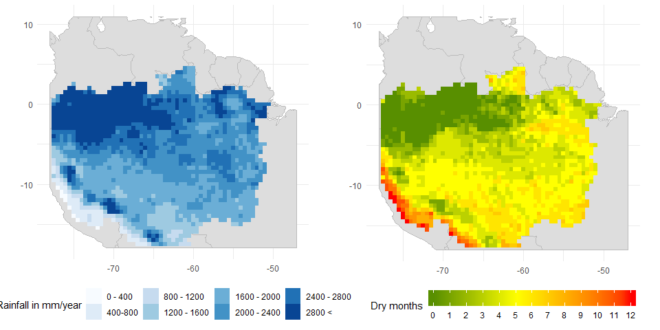


```r
cycleLine1 <- list("black", 1, "dotted", 50)
cycleLine2 <- list("black", 1, "dotted", 100)
cycleLine3 <- list("black", 1, "dotted", 150)
divisions <- c(-64.5, -7)
regions <- c("NW", "NE", "SW", "SE")

pPetRibbon <- amazonWD %>%
  mutate(region = ifelse(lon < divisions[1] & lat > divisions[2], regions[1],
                         ifelse(lon < divisions[1] & lat <= divisions[2], regions[3],
                                ifelse(lon >= divisions[1] & lat > divisions[2], regions[2],
                                       ifelse(lon >= divisions[1] & lat <= divisions[2], regions[4], NA))))) %>%
  group_by(region, month) %>%
  summarise(pet = mean(pet), pre = mean(preTrmm)) %>%
  ungroup() %>%
  mutate(date = as.Date(paste("2005", as.character(month), "01"), format = "%Y%m%d"),
         region = factor(region, regions)) %>%
  ggplot(aes(x = date)) +
  geom_line(aes(y = pet), size = 2, color = "red") +
  geom_line(aes(y = pre), size = 2, color = "blue") +
  geom_ribbon(aes(ymin=pre,ymax=pet, fill= ifelse(pre < pet, TRUE, NA), alpha=0.6)) +
  scale_fill_manual("",values=c("red"))+
  scale_x_date(date_labels = "%b") +
  theme(axis.title.x.bottom = element_blank(),
        axis.title.y.left = element_blank(),
        legend.position = "none") +
  geom_hline(yintercept=cycleLine1[[4]], linetype=cycleLine1[[3]], size=cycleLine1[[2]], color = cycleLine1[[1]]) +
  geom_hline(yintercept=cycleLine2[[4]], linetype=cycleLine2[[3]], size=cycleLine2[[2]], color = cycleLine2[[1]]) +
  geom_hline(yintercept=cycleLine3[[4]], linetype=cycleLine3[[3]], size=cycleLine3[[2]], color = cycleLine3[[1]]) +
  facet_wrap(region~.)

cwdRibbon <- amazonWD %>%
  mutate(region = ifelse(lon < divisions[1] & lat > divisions[2], regions[1],
                         ifelse(lon < divisions[1] & lat <= divisions[2], regions[3],
                                ifelse(lon >= divisions[1] & lat > divisions[2], regions[2],
                                       ifelse(lon >= divisions[1] & lat <= divisions[2], regions[4], NA))))) %>%
  group_by(region, month) %>%
  summarise(pet = mean(pet), aet = mean(aet)) %>%
  ungroup() %>%
  mutate(date = as.Date(paste("2005", as.character(month), "01"), format = "%Y%m%d"),
         region = factor(region, regions)) %>%
  ggplot(aes(x = date)) +
  geom_line(aes(y = pet), size = 2, color = "red") +
  geom_line(aes(y = aet), size = 2, color = "springgreen3") +
  geom_ribbon(aes(ymin=aet,ymax=pet, fill= ifelse(pet > aet, TRUE, NA), alpha=0.6)) +
  scale_fill_manual("",values=c("red"))+
  scale_x_date(date_labels = "%b") +
  theme(axis.title.x.bottom = element_blank(),
        axis.title.y.left = element_blank(),
        legend.position = "none") +
  geom_hline(yintercept=cycleLine2[[4]], linetype=cycleLine2[[3]], size=cycleLine2[[2]], color = cycleLine2[[1]]) +
  geom_hline(yintercept=cycleLine3[[4]], linetype=cycleLine3[[3]], size=cycleLine3[[2]], color = cycleLine3[[1]]) +
  facet_wrap(region~.)

grid.arrange(pPetRibbon, cwdRibbon, ncol=2)
```


The figure above presents the annual cyclc of:

* Blue line - TRMM rainfall
* Red line - Princeton University PET
* Green line - LandFlux EVAL AET synthesis product

## MCWD time series

### Correlation of annual MCWD anomalies


```r
#anomalies correlation plot---
corrplot(cor.fk(
            as.data.frame(
               anomaliesSd %>% select(-year, -lon, -lat))),
         method = 'color',
         type = 'lower',
         addCoef.col = "black",
         diag = FALSE,
         tl.col="black",
         tl.srt=90,
         tl.cex = 1,
         cl.cex = 1,
         cl.lim = c(0, 1),
         col=colorRampPalette(c("firebrick4", "red", "pink",
                                "lightsteelblue1","lightsteelblue1","lightsteelblue", "lightsteelblue3"))(200),
         number.cex = 1) #Text label color and rotation
```

```
## Warning in ind1:ind2: numerical expression has 33 elements: only the first
## used
```

```
## Warning in ind1:ind2: numerical expression has 2 elements: only the first
## used
```

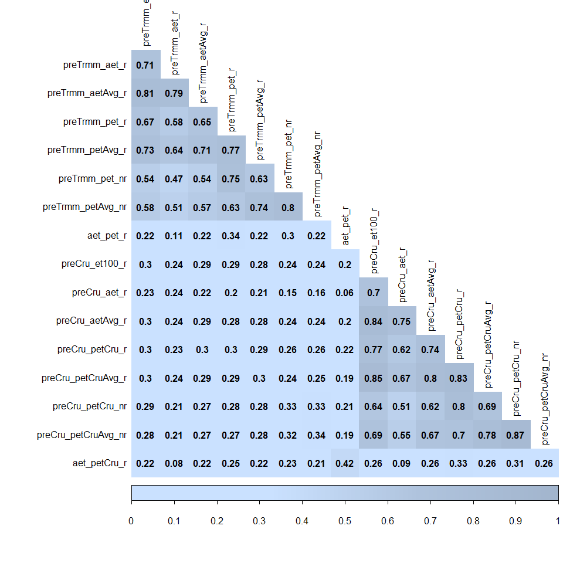

### Annual MCWD values (in mm)


```r
#Specifying precise order
mcwdTypes <- c("CWD_Pr","WDfixed_T","WDaet_T","WDaet2_T",
              "WDpet_T", "WDpet2_T", "WDpet_T*", "WDpet2_T*",
              "CWD_Cr", "WDfixed_C", "WDaet_C", "WDaet2_C",	
              "WDpet_C", "WDpet2_C", "WDpet_C*", "WDpet2_C*")

#absDeviations FROM MEAN (in mm)----
absDeviations <- anomalies %>%
                    select(year, lon, lat,
                           "CWD_Pr"	= aet_pet_r,			
                           "WDfixed_T" = preTrmm_et100_r,	
                           "WDaet_T"		= preTrmm_aet_r,	
                           "WDaet2_T"	= preTrmm_aetAvg_r,
                           "WDpet_T"		= preTrmm_pet_r,		
                           "WDpet2_T"	= preTrmm_petAvg_r,		
                           "WDpet_T*"	= preTrmm_pet_nr,	
                           "WDpet2_T*"	= preTrmm_petAvg_nr,
                           "CWD_Cr"		= aet_petCru_r,		
                           "WDfixed_C"	= preCru_et100_r,	
                           "WDaet_C"		= preCru_aet_r,		
                           "WDaet2_C"	= preCru_aetAvg_r,	
                           "WDpet_C"		= preCru_petCru_r,		
                           "WDpet2_C"	= preCru_petCruAvg_r,	
                           "WDpet_C*"	= preCru_petCru_nr,	
                           "WDpet2_C*"	= preCru_petCruAvg_nr)
absDeviations <- gather(absDeviations, key = "mcwd", value = "deviation", 4:ncol(absDeviations))

absDeviations$mcwd <- factor(absDeviations$mcwd, mcwdTypes)

deviationLevels <- c(-200, -150, -100, -50, -25, 0)
deviationLabels <- c("< -200", "< -150", "< -100", "< -50", "< -25", "< 0", "> 0")
deviationColors <- rev(c("greenyellow", "yellow", "orange", "indianred2", "red", "firebrick4"))

absDeviations <- absDeviations %>%
  ungroup() %>%
  mutate(deviationFromMean = ifelse(deviation < deviationLevels[1], deviationLabels[1],
                                    ifelse(deviation < deviationLevels[2], deviationLabels[2],
                                           ifelse(deviation < deviationLevels[3], deviationLabels[3],
                                                  ifelse(deviation < deviationLevels[4], deviationLabels[4],
                                                         ifelse(deviation < deviationLevels[5], deviationLabels[5],
                                                                ifelse(deviation < deviationLevels[6], deviationLabels[6], "> 0"))))))) %>%
  filter(deviationFromMean != "> 0")

absDeviations$deviationFromMean <- factor(absDeviations$deviationFromMean,  deviationLabels)

absDeviations %>%
  regmap(region = "ama") +
  geom_tile(aes(fill = deviationFromMean)) +
  scale_fill_manual(values = deviationColors, name = "Annual MCWD anomaly in mm") +
  facet_grid(mcwd ~ year) +
  theme(axis.title.x = element_blank(),
        axis.title.y = element_blank(),
        axis.text.y.left = element_blank(),
        axis.text.x.bottom = element_blank(),
        legend.position = "left",
        legend.direction = "vertical",
        legend.key.height = unit(2, "cm"),
        legend.text = element_text(size = 14, angle = 90),
        legend.title = element_text(size = 14, angle = 90),
        strip.text.x = element_text(size = 14),
        strip.text.y = element_text(size = 12, angle = 0, vjust = 0.5, hjust = 0))
```

```
## Warning: Removed 4041 rows containing missing values (geom_tile).
```

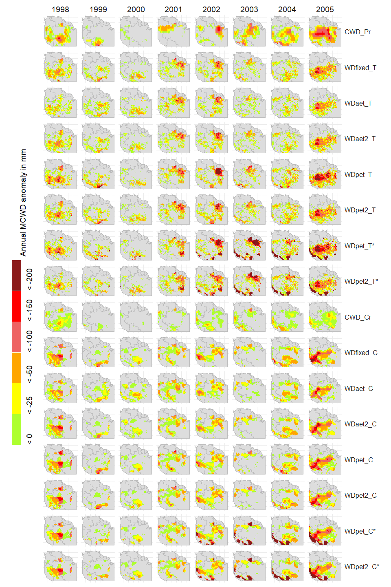

### Annual MCWD (in standardized anomalies)


```r
## anomalies ind standard deviations ----
anomaliesSdBackUp <- anomaliesSd %>%
  select(year, lon, lat,
         "CWD_Pr"	= aet_pet_r,			
         "WDfixed_T" = preTrmm_et100_r,	
         "WDaet_T"		= preTrmm_aet_r,	
         "WDaet2_T"	= preTrmm_aetAvg_r,
         "WDpet_T"		= preTrmm_pet_r,		
         "WDpet2_T"	= preTrmm_petAvg_r,		
         "WDpet_T*"	= preTrmm_pet_nr,	
         "WDpet2_T*"	= preTrmm_petAvg_nr,
         "CWD_Cr"		= aet_petCru_r,		
         "WDfixed_C"	= preCru_et100_r,	
         "WDaet_C"		= preCru_aet_r,		
         "WDaet2_C"	= preCru_aetAvg_r,	
         "WDpet_C"		= preCru_petCru_r,		
         "WDpet2_C"	= preCru_petCruAvg_r,	
         "WDpet_C*"	= preCru_petCru_nr,	
         "WDpet2_C*"	= preCru_petCruAvg_nr)

#AnomaliesSd maps
anomaliesSdBackUp <- gather(anomaliesSdBackUp, key = "mcwd", value = "anomalySd", 4:ncol(anomaliesSdBackUp))

anomaliesSdBackUp$mcwd <- factor(anomaliesSdBackUp$mcwd, mcwdTypes)

anomalyLevels <- c(-2, -1.5, -1, 1, 1.5, 2)
anomalyLables <- c("< -2", "< -1.5", "< -1", "-1 to 1", "< 1", "< 1.5", "< 2")

anomaliesSdBackUp <- anomaliesSdBackUp %>%
  ungroup() %>%
  mutate(sdLevel = ifelse(anomalySd < anomalyLevels[1], anomalyLables[1],
                          ifelse(anomalySd < anomalyLevels[2], anomalyLables[2],
                                 ifelse(anomalySd < anomalyLevels[3], anomalyLables[3],
                                        ifelse(anomalySd <  anomalyLevels[4], anomalyLables[4],
                                               ifelse(anomalySd < anomalyLevels[5], anomalyLables[5],
                                                      ifelse(anomalyLevels < anomalyLevels[6], anomalyLables[6], anomalyLables[7])))))))
anomaliesSdBackUp$sdLevel <- factor(anomaliesSdBackUp$sdLevel, rev(anomalyLables))

anomaliesSdBackUp %>%
  regmap(region = "ama") +
  geom_tile(aes(fill = anomalySd)) +
  scale_fill_gradient2(low = "#FF3300", midpoint = 0, mid = "ivory", high = "#0000FF", name = "SD",
                       breaks = c(min(anomaliesSdBackUp$anomalySd), seq(-2, -1, 0.5), seq(1, 2, 0.5)),
                       labels = c(min(anomaliesSdBackUp$anomalySd), seq(-2, -1, 0.5), seq(1, 2, 0.5))) +
  facet_grid(mcwd ~ year) +
  theme(axis.title.x = element_blank(),
        axis.title.y = element_blank(),
        axis.text.y.left = element_blank(),
        axis.text.x.bottom = element_blank(),
        legend.position = "left",
        legend.direction = "vertical",
        legend.key.height = unit(3, "cm"),
        legend.text = element_text(size = 14),
        legend.title = element_text(size = 14),
        strip.text.x = element_text(size = 14),
        strip.text.y = element_text(size = 12, angle = 0, vjust = 0.5, hjust = 0))
```

```
## Warning: Removed 8448 rows containing missing values (geom_tile).
```


### Monthly anomalies correlation


```r
#Monthly correlation (MMCWD, SPEI and SPI)
indicesTimeSeries <- amazonWD[complete.cases(amazonWD),] %>%
  select(starts_with("spei"), starts_with("spi"), ends_with("monthlySd"))

indicesTimeSeries <- indicesTimeSeries %>%
  select(CWD_Pr = cwd_aet_pet_r_monthlySd,
         SPEI03_T = speiTrmm03,
         SPI03_T = spiTrmm03,
         "WDfixed_T" = cwd_preTrmm_et100_r_monthlySd,
         "WDaet_T" = cwd_preTrmm_aet_r_monthlySd,
         "WDaet2_T" = cwd_preTrmm_aetAvg_r_monthlySd,
         "WDpet_T" = cwd_preTrmm_pet_r_monthlySd,
         "WDpet2_T" = cwd_preTrmm_petAvg_r_monthlySd,
         "WDpet_T*" = cwd_preTrmm_pet_nr_monthlySd,
         "WDpet2_T*" = cwd_preTrmm_petAvg_nr_monthlySd,
         CWD_Cr = cwd_aet_petCru_r_monthlySd,
         SPEI03_C = speiCru03,
         SPI03_C = spiCru03,
         "WDfixed_C" = cwd_preCru_et100_r_monthlySd,
         "WDaet_C" = cwd_preCru_aet_r_monthlySd,
         "WDaet2_C" = cwd_preCru_aetAvg_r_monthlySd,
         "WDpet_C" = cwd_preCru_petCru_r_monthlySd,
         "WDpet2_C" = cwd_preCru_petCruAvg_r_monthlySd,
         "WDpet_C*" = cwd_preCru_petCru_nr_monthlySd,
         "WDpet2_C*" = cwd_preCru_petCruAvg_nr_monthlySd)

corrplot.mixed(cor.fk(indicesTimeSeries), order = "AOE", addrect = 3,
               tl.cex = 1, tl.pos = "lt", cl.cex = 1, number.cex = 0.8)
```

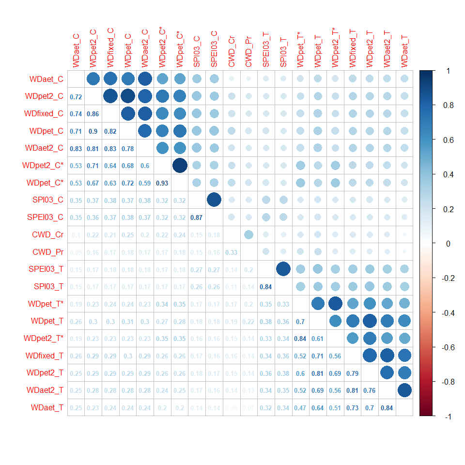

### Test of parallel agreement


```r
#gleichlaufigkeit -----
source('glk.R')

gleichlaufigkeit <- glk(indicesTimeSeries)

corrplot(gleichlaufigkeit,
         is.corr = FALSE,
         method = 'color',
         cl.lim = c(min(gleichlaufigkeit),max(gleichlaufigkeit)),
         col=colorRampPalette(c("firebrick4", "red", "pink", "darkseagreen1","darkseagreen2","darkseagreen3", "darkseagreen"))(50),
         type = 'lower',
         addCoef.col = "black",
         diag = FALSE,
         tl.col="black", tl.srt=90, tl.cex = 1, cl.cex = 1, number.cex = 0.9) #Text label color and rotation
```

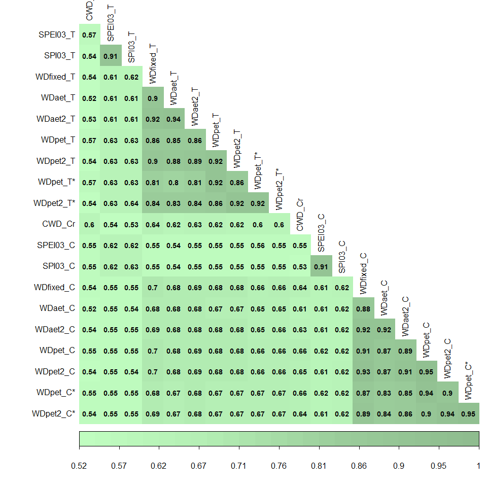

## SPEI and SPI in 2005


```r
amazonWD %>%
  select(lon, lat, year, month, SPEI03_T = speiTrmm03, SPI03_T = spiTrmm03, SPEI03_C = speiCru03, SPI03_C = spiCru03) %>%
  filter(year == 2005 & month %in% c(6, 7, 8, 9, 10)) %>%
  mutate(month = factor(ifelse(month == 6, "June",
                               ifelse(month == 7, "July",
                                      ifelse(month == 8, "August",
                                             ifelse(month == 9, "September", "October")))), c("June", "July", "August", "September", "October"))) %>%
  gather(source, value, c("SPEI03_T", "SPI03_T", "SPEI03_C", "SPI03_C")) %>%
  mutate(source = factor(source, c("SPEI03_T", "SPI03_T", "SPEI03_C", "SPI03_C"))) %>%
  regmap(region = "ama") +
  geom_tile(aes(x = lon, y = lat, fill = value)) +
  theme(strip.text.y = element_text(size = 16),
        strip.text.x = element_text(size = 16),
        axis.text.x.bottom = element_text(size = 12),
        axis.text.y.left = element_text(size = 12),
        axis.title.y.left = element_text(size = 12),
        axis.title.x.bottom = element_text(size = 12)) +
  scale_fill_gradient2() +
  facet_grid(source~month)
```

```
## Warning: Removed 1320 rows containing missing values (geom_tile).
```

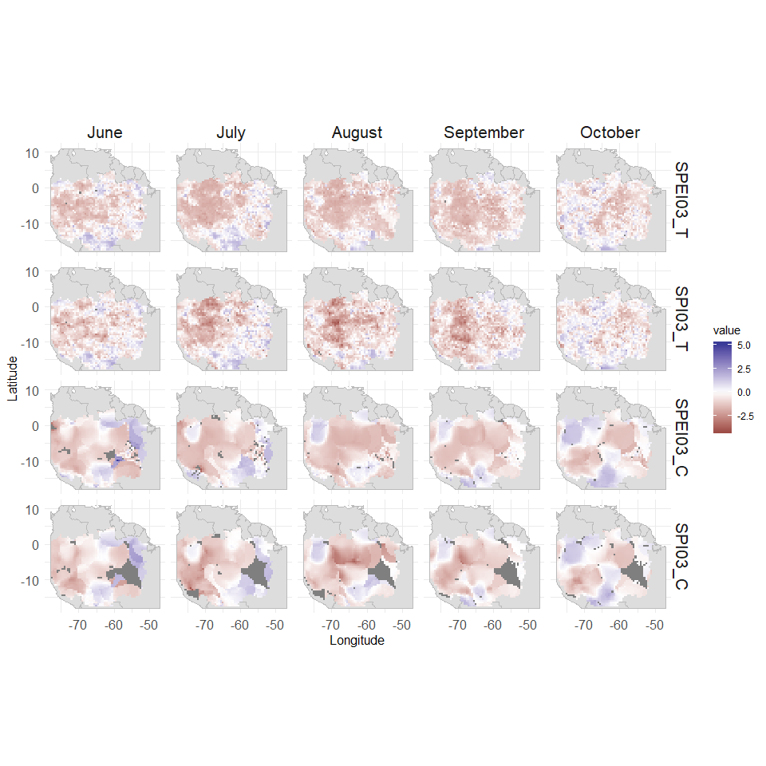

##Temporal development and spatial extent

###Monthly MCWD, SPEI and SPI anomalies temporal development


```r
#Time series of drought categories with all indices
droughtCategories <- c("Extremely dry/ < -1.6", "Severely dry/ < -1.3", "Moderately dry/ < -0.8", "Abnormally dry/ < -0.5")
droughtLevels <- c(-1.6, -1.3, -0.8, -0.5)

colNames = c("speiTrmm03", "cwd_preTrmm_et100_r_monthlySd", "cwd_preTrmm_aet_r_monthlySd", "cwd_preTrmm_pet_r_monthlySd", "cwd_preTrmm_pet_nr_monthlySd",
                 "spiTrmm03", "cwd_aet_pet_r_monthlySd","cwd_preTrmm_aetAvg_r_monthlySd", "cwd_preTrmm_petAvg_r_monthlySd", "cwd_preTrmm_petAvg_nr_monthlySd",
                 "speiCru03", "cwd_preCru_et100_r_monthlySd", "cwd_preCru_aet_r_monthlySd",  "cwd_preCru_petCru_r_monthlySd", "cwd_preCru_petCru_nr_monthlySd", 
                 "spiCru03", "cwd_aet_petCru_r_monthlySd",  "cwd_preCru_aetAvg_r_monthlySd",  "cwd_preCru_petCruAvg_r_monthlySd", "cwd_preCru_petCruAvg_nr_monthlySd")

titles = c("SPEI03_T", "WDfixed_T", "WDaet_T",  "WDpet_T",  "WDpet_T*",
           "SPI03_T",  "CWD_Pr",  "WDaet2_T", "WDpet2_T", "WDpet2_T*",
           "SPEI03_C", "WDfixed_C", "WDaet_C", "WDpet_C", "WDpet_C*",       
           "SPI03_C", "CWD_Cr", "WDaet2_C", "WDpet2_C", "WDpet2_C*")

droughtLevelsFun <- function(colName = "", title = ""){
  definePalette <- "Reds"
  topHline <- list("firebrick", 2, "dashed", 40)
  lowHline <- list("chocolate1", 2, "dashed", 20)
  
  severityLevels <- amazonWD[complete.cases(amazonWD),] %>%
    dplyr::select(year, month, lon, lat, indexName = !!as.name(colName)) %>%
    mutate(date = make_date(year, month, 01),
           severityLevel =          ifelse(indexName < droughtLevels[1], droughtCategories[1],
                                           ifelse(indexName < droughtLevels[2], droughtCategories[2],
                                                  ifelse(indexName < droughtLevels[3], droughtCategories[3],
                                                         ifelse(indexName < droughtLevels[4], droughtCategories[4], "Near normal or wet"))))) %>%
    group_by(date, severityLevel) %>%
    summarise(percentage = round((n()/1945)*100), 0) %>%
    filter(severityLevel != "Near normal or wet")
  
  severityLevels$severityLevel <- factor(severityLevels$severityLevel, droughtCategories)
  
  sev <- expand.grid(date = unique(severityLevels$date), severityLevel = unique(severityLevels$severityLevel))
  
  severityLevels <- full_join(severityLevels, sev, by = c("date" = "date", "severityLevel" = "severityLevel"))
  
  severityLevels$percentage[which(is.na(severityLevels$percentage))] <- 0
  # severityLevels <- severityLevels %>%
  #   mutate(percentage = ifelse(is.na(percentage), 0, percentage))
  
  severityLevelsPlot <- ggplot(severityLevels, aes(x=date, y=percentage, fill=severityLevel, color)) +
    geom_area(colour="black", size=.2, alpha=.4) +
    scale_fill_brewer(palette=definePalette, direction = -1, breaks=rev(levels(severityLevels$severityLevel))) +
    ggtitle(title) +
    geom_hline(yintercept=topHline[[4]], linetype=topHline[[3]], size=topHline[[2]], color = topHline[[1]]) +
    labs(y = "Drought extent (in %)") +
    #geom_hline(yintercept=lowHline[[4]], linetype=lowHline[[3]], size=lowHline[[2]], color = lowHline[[1]]) +
    theme(axis.title.y.left = element_text(size = 12),
          axis.title.x.bottom = element_blank(),
          axis.text.x.bottom = element_text(size = 18),
          axis.text.y.left = element_text(size = 18),
          legend.position = "bottom",
          legend.direction = "horizontal",
          legend.key.width = unit(2, "cm"),
          legend.text = element_text(size = 13),
          legend.title = element_text(size = 16),
          title = element_text(size = 24),
          plot.title = element_text(size=14),
          strip.text = element_text(size = 18))
  
  return(severityLevelsPlot)
}
  
  plots <- list()
  
  for (varIndex in 1:length(colNames)) {
    var = colNames[varIndex]
    title = titles[varIndex]
    plot = droughtLevelsFun(var, title)
    plots[[varIndex]] <- eval(substitute(plot))
  }
  
do.call(ggarrange, c(plotlist = plots, nrow = 4, ncol = 5, common.legend = TRUE, legend = "bottom"))
```


### Spatial extent of the 2005 drought (Jun-Aug-Sep) (1)


```r
guideLine60 <- list(60, "dotted", 2, "orange")
guideLine50 <- list(50, "dotted", 2, "yellow")
guideLine40 <- list(40, "dotted", 2, "white")

extent2005 <- amazonWD[complete.cases(amazonWD),] %>%
  filter(year == 2005 & month %in% 7:9) %>%
  select(starts_with("spei"), starts_with("spi"), ends_with("monthlySd"), -ends_with("nr_monthlySd")) %>%
  gather() %>%
  mutate(source = ifelse(grepl("cwd_aet", key, fixed = TRUE), "AET-PET",
                        ifelse(grepl("Cru", key, fixed = TRUE), "CRU","TRMM")),
         severityLevel = ifelse(value < droughtLevels[1], droughtCategories[1],
                               ifelse(value < droughtLevels[2], droughtCategories[2],
                                      ifelse(value < droughtLevels[3], droughtCategories[3],
                                             ifelse(value < droughtLevels[4], droughtCategories[4], "Near normal or wet"))))) %>%
  filter(severityLevel != "Near normal or wet") %>% 
  group_by(key, severityLevel, source) %>%
  summarise(percentage = round((n()/1945)*100 /3,0)) %>%
  group_by(key) %>%
  mutate(sumPercentages = sum(percentage)) %>%
  ungroup() %>%
  mutate(labelPercentage = ifelse(percentage > 2, paste(percentage, "%"), ""),
         severityLevel = factor(severityLevel, droughtCategories))

  extent2005$key[which(extent2005$key == "cwd_aet_petCru_r_monthlySd")] <- "CWD_Cr"
  extent2005$key[which(extent2005$key == "cwd_aet_pet_r_monthlySd")] <- "CWD_Pr"
  extent2005$key[which(extent2005$key == "speiCru03" | extent2005$key == "speiTrmm03")] <- "SPEI03"
  extent2005$key[which(extent2005$key == "spiCru03" | extent2005$key == "spiTrmm03")] <- "SPI03"
  extent2005$key[which(extent2005$key == "cwd_preCru_aet_r_monthlySd" | extent2005$key == "cwd_preTrmm_aet_r_monthlySd")] <- "WDaet"
  extent2005$key[which(extent2005$key == "cwd_preCru_aetAvg_r_monthlySd" | extent2005$key == "cwd_preTrmm_aetAvg_r_monthlySd")] <- "WDaet2"
  extent2005$key[which(extent2005$key == "cwd_preCru_petCru_r_monthlySd" | extent2005$key == "cwd_preTrmm_pet_r_monthlySd")] <- "WDpet"
  extent2005$key[which(extent2005$key == "cwd_preCru_petCruAvg_r_monthlySd" | extent2005$key == "cwd_preTrmm_petAvg_r_monthlySd")] <- "WDpet2"
  extent2005$key[which(extent2005$key == "cwd_preCru_et100_r_monthlySd" | extent2005$key == "cwd_preTrmm_et100_r_monthlySd")]  <- "WDfixed"
  
 extent2005 %>%
  filter(source != "AET-PET") %>%
  ggplot(aes(x=key, y=percentage, fill=severityLevel)) + 
  geom_bar(stat="identity") +
  geom_text(aes(label = labelPercentage), position = position_stack(vjust = 0.5), size = 7) +
  xlab("Indices (SPEI/SPI/MCWD)\n") +
  ylab("Drought extent for the 2005 dry season - JAS (in %)") +
  scale_fill_brewer(palette = "Reds", direction = -1) +
  theme(axis.text.x.bottom = element_text(size = 16, hjust = 1),
        axis.text.y.left = element_text(size = 16),
        axis.title.x.bottom = element_text(size = 18),
        axis.title.y.left = element_text(size = 18),
        title = element_text(size = 28),
        legend.position = "bottom",
        legend.direction = "horizontal",
        legend.key.width = unit(2.5, "cm"),
        legend.text = element_text(size = 15),
        legend.title = element_text(size = 0, hjust = 0),
        strip.text.x = element_text(size = 28)) +
  # geom_hline(yintercept=guideLine60[[1]], linetype=guideLine60[[2]], size=guideLine60[[3]], color = guideLine60[[4]]) +
  # geom_hline(yintercept=guideLine50[[1]], linetype=guideLine50[[2]], size=guideLine50[[3]], color = guideLine50[[4]]) +
  # geom_hline(yintercept=guideLine40[[1]], linetype=guideLine40[[2]], size=guideLine40[[3]], color = guideLine40[[4]]) +
  coord_flip() +
  facet_wrap(source~.)
```

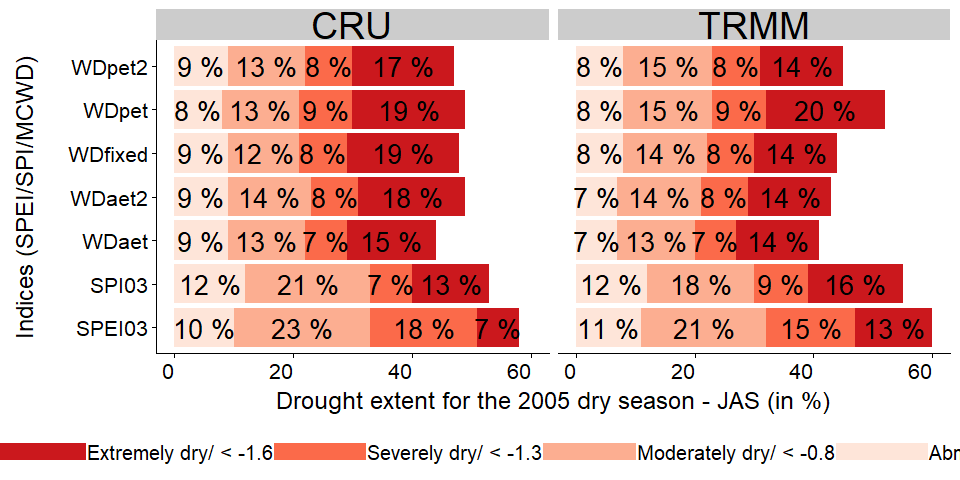

### Spatial extent of the 2005 drought (Jun-Aug-Sep) (2)


```r
##AET-PET severity extent throughout 2005
extent2005 %>%
   filter(source == "AET-PET") %>%
   ggplot(aes(x=key, y=percentage, fill=severityLevel)) + 
   geom_bar(stat="identity") +
   geom_text(aes(label = labelPercentage), position = position_stack(vjust = 0.5), size = 9) +
   xlab("Indices (MCWD)") +
   ylab("Drought extent for the 2005 dry season - JAS (in %)") +
   guides(fill=guide_legend(nrow = 2, byrow = TRUE)) +
   scale_fill_brewer(palette = "Reds", direction = -1) +
   theme(axis.text.x.bottom = element_text(size = 12, hjust = 0.5),
         axis.text.y.left = element_text(size = 12),
         axis.title.x.bottom = element_text(size = 14),
         axis.title.y.left = element_text(size = 14),
         legend.position = "bottom",
         legend.direction = "horizontal",
         legend.key.width = unit(1, "cm"),
         legend.text = element_text(size = 12),
         legend.title = element_text(size = 0, hjust = 0),
         title = element_text(size = 28)) #+
```

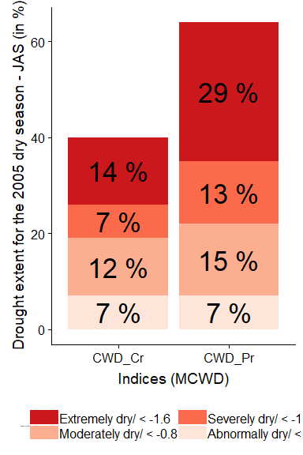

```r
   #geom_hline(yintercept=guideLine60[[1]], linetype=guideLine60[[2]], size=guideLine60[[3]], color = guideLine60[[4]]) +
   #geom_hline(yintercept=guideLine40[[1]], linetype=guideLine40[[2]], size=guideLine40[[3]], color = guideLine40[[4]])
```

### Spatial extent of the 2005 drought (annual) (1)


```r
  absDeviationLevelsFun <- function(wdName = "", title = ""){
    definePalette <- deviationColors
    hline <- list("firebrick", 2, "dashed", 40)
    colorScheme <- c(deviationColors[1:6])
    
    #the next condition takes into account that the time series
    #in quastion have not registered any pixels of the highest categories
    if (wdName == "CWD_Pr") {
      colorScheme <- c(deviationColors[2:6])
    } else if (wdName == "CWD_Cr"){
      colorScheme <- c(deviationColors[3:6])
    }
    
    dep <-  absDeviations %>%
      filter(mcwd == wdName) %>%
      filter(deviationFromMean != "> 0") %>%
      group_by(mcwd, deviationFromMean, year) %>%
      summarise(percentage = round((n()/1945)*100, 0))
    
    d <- expand.grid(year = unique(dep$year), deviationFromMean = unique(dep$deviationFromMean))
    dep <- full_join(d, dep, by = c("year" = "year", "deviationFromMean" = "deviationFromMean")) %>%
      mutate(percentage = ifelse(is.na(percentage), 0, percentage),
             mcwd = wdName) %>%
      arrange(year, deviationFromMean)
    
    
    dep <- dep %>%
      filter(mcwd == wdName) %>%
      ggplot(aes(x=year, y=percentage, fill=deviationFromMean)) +
      geom_area(stat = "identity", colour="black", size=.2, alpha=.4) +
      scale_fill_manual(values=colorScheme) +
      ggtitle(title) +
      labs(y = "Drought extent (in %)") +
      guides(fill=guide_legend(title="Deviation from\n mean (in mm)")) + 
      #geom_hline(yintercept=hline[[4]], linetype=hline[[3]], size=hline[[2]], color = hline[[1]]) +
      theme(axis.title.y.left = element_text(size = 12),
            axis.title.x.bottom = element_blank(),
            legend.position = "bottom",
            legend.direction = "horizontal",
            legend.key.width = unit(3, "cm"),
            legend.text = element_text(size = 18),
            legend.title = element_text(size = 18))
    
    return(dep)
  }

  titlesAnnual <- c("WDfixed_T", "WDaet_T", "WDpet_T", "WDpet_T*",   
                    "CWD_Pr", "WDaet2_T", "WDpet2_T",  "WDpet2_T*",
                    "WDfixed_C", "WDaet_C", "WDpet_C", "WDpet_C*",
                    "CWD_Cr", "WDaet2_C", "WDpet2_C", "WDpet2_C*")
  
  
  absDeviationsPlots <- list()
  for (wdIndex in 1:length(titlesAnnual)) {
    var = as.character(titlesAnnual[wdIndex])
    plot = absDeviationLevelsFun(var, var)
    absDeviationsPlots[[wdIndex]] <- eval(substitute(plot))
  }
  
  do.call(ggarrange, c(plotlist = absDeviationsPlots, nrow = 4, ncol = 4, common.legend = TRUE, legend = "bottom"))
```

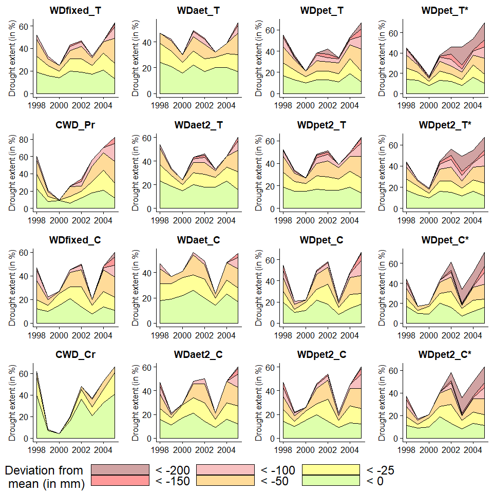

### Spatial extent of the 2005 drought (annual) (2)


```r
#absDeviations (in mm)
 severityExtent <- absDeviations %>%
   filter(year == 2005 & deviationFromMean != "> 0" & !grepl("*",mcwd, fixed = TRUE)) %>%
   mutate(source = ifelse(grepl("CWD_", mcwd, fixed = TRUE), "CWD",
                          ifelse(grepl("_C", mcwd, fixed = TRUE), "CRU","TRMM"))) %>%
   group_by(mcwd, deviationFromMean, source) %>%
   summarise(percentage = round((n()/1945)*100, 0)) %>%
   filter(percentage != 0)

 severityExtent$mcwd <- as.character(severityExtent$mcwd)

severityExtent$mcwd[which(severityExtent$mcwd == "aet_pet_r")] <- "CWD_Pr"
severityExtent$mcwd[which(severityExtent$mcwd == "aet_petCru_r")] <- "CWD_Cr"
severityExtent$mcwd[which(severityExtent$mcwd == "WDfixed_T" | severityExtent$mcwd == "WDfixed_C")] <- "WDfixed"
severityExtent$mcwd[which(severityExtent$mcwd == "WDpet_T" | severityExtent$mcwd == "WDpet_C")] <- "WDpet"
severityExtent$mcwd[which(severityExtent$mcwd == "WDpet2_T" | severityExtent$mcwd == "WDpet2_C")] <- "WDpet2"
severityExtent$mcwd[which(severityExtent$mcwd == "WDaet_T" | severityExtent$mcwd == "WDaet_C")] <- "WDaet"
severityExtent$mcwd[which(severityExtent$mcwd == "WDaet2_T" | severityExtent$mcwd == "WDaet2_C")] <- "WDaet2"

severityExtent %>%
  filter(source != "CWD") %>%
  mutate(labelPercentage = ifelse(percentage > 3, paste(percentage, "%"), "")) %>%
  ggplot(aes(x=mcwd, y=percentage, fill=deviationFromMean)) + 
  geom_bar(stat="identity") +
  geom_text(aes(label = labelPercentage), position = position_stack(vjust = 0.5), size = 5) +
  xlab("Annual MCWD values for 2005\n") +
  ylab("Drought extent (in %)") +
  scale_fill_manual(values = deviationColors[1:length(deviationColors)]) +
  theme(
        axis.text.x.bottom = element_text(size = 18),
        axis.text.y.left = element_text(size = 18),
        legend.position = "bottom",
        legend.direction = "horizontal",
        legend.key.width = unit(3, "cm"),
        legend.text = element_text(size = 14),
        legend.title = element_text(size = 14),
        strip.text = element_text(size = 24)) +
  # geom_hline(yintercept=guideLine60[[1]], linetype=guideLine60[[2]], size=guideLine60[[3]], color = guideLine60[[4]]) +
  # geom_hline(yintercept=guideLine50[[1]], linetype=guideLine50[[2]], size=guideLine50[[3]], color = guideLine50[[4]]) +
  # geom_hline(yintercept=guideLine40[[1]], linetype=guideLine40[[2]], size=guideLine40[[3]], color = guideLine40[[4]]) +
  coord_flip() +
  facet_wrap(source~.)
```


### Annual MCWD anomalies temporal development


```r
severityExtent %>%
  filter(source == "CWD") %>%
  mutate(labelPercentage = ifelse(percentage > 3, paste(percentage, "%"), "")) %>%
  ggplot(aes(x=mcwd, y=percentage, fill=deviationFromMean)) + 
  geom_bar(stat="identity") +
  geom_text(aes(label = labelPercentage), position = position_stack(vjust = 0.5), size = 7) +
  xlab("\nAnnual MCWD values for 2005") +
  ylab("Drought extent (in %)") +
  scale_fill_manual(values = deviationColors[2:length(deviationColors)]) +
  theme(axis.text.x.bottom = element_text(size = 14),
    axis.text.y.left = element_text(size = 14),
    legend.position = "bottom",
    legend.direction = "horizontal",
    legend.key.width = unit(1, "cm"),
    legend.text = element_text(size = 12),
    legend.title = element_text(size = 0, hjust = 0),
    strip.text = element_text(size = 24)) # +
```

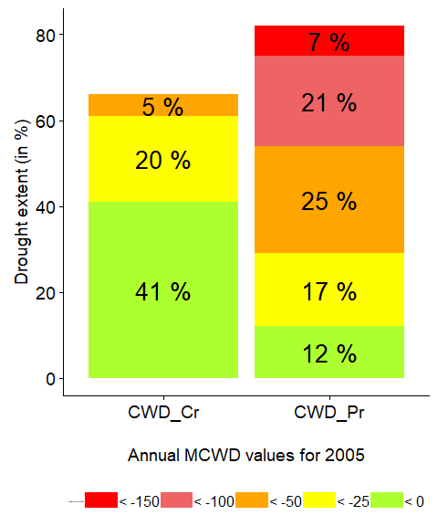

```r
  # geom_hline(yintercept=60, linetype=guideLine40[[2]], size=guideLine40[[3]], color = guideLine40[[4]])
```


```r
#Spatial correlation function. Accomadates both monthly and annual anomalies as the @dataset is defining-----
spatialCorrelation <- function(dataset, var1 = "", var2 = "", title = "", period =  1998:2005, ylabTitle = "")
{
  dataset %>%
    filter(year %in% period) %>%
    select(lon, lat, !!as.name(var1), !!as.name(var2))  %>%
    filter(complete.cases(.)) %>%
    group_by(lon,lat) %>%
    summarise(spatialCor = cor(!!as.name(var1), !!as.name(var2), method = "kendall")) %>%
    regmap(region = "ama") +
    geom_tile(aes(fill = spatialCor)) +
    scale_fill_gradientn(name = "Kendall tau", 
                         colours = c("tomato3", "lightgoldenrod1", "royalblue1"),
                         values = scales::rescale(c(-1, -0.6, 0, 0.6, 1))) +
    labs(title = title, y = ylabTitle) +
    theme(plot.title = element_text(hjust = 0.5),
          axis.title.x = element_blank(),
          axis.title.y = element_text(size = 10),
          axis.text.y = element_blank(),
          axis.text.x = element_blank(),
          legend.position = "bottom",
          legend.key.height = unit(1, "cm"),
          legend.text = element_text(size = 14),
          legend.title = element_text(size = 14),
          strip.text = element_text(size = 18))
}
```

## Spatial correlation

### Spatial correlation between monthly MCWD time series computed with same data


```r
#Plotting of monthly anomalies of MCWD computed with TRMM against SPEI and SPI------
SCPlots <- list() #spatial correlation plots

SCPairs <- list(c("cwd_preTrmm_et100_r_monthlySd", "cwd_preTrmm_petAvg_r_monthlySd", "WDfixed_T vs WDpet_T"),
                c("cwd_preTrmm_et100_r_monthlySd", "cwd_preTrmm_aetAvg_r_monthlySd", "WDfixed_T vs WDaet_T"),
                c("cwd_preTrmm_et100_r_monthlySd", "cwd_aet_pet_r_monthlySd", "WDfixed_T vs CWD_Pr"),
                c("cwd_preTrmm_et100_r_monthlySd", "spiTrmm03", "WDfixed_T vs SPI03_T"),
                c("cwd_preTrmm_et100_r_monthlySd", "speiTrmm03", "WDfixed_T vs SPEI03_T"),
                c("spiTrmm03", "speiTrmm03", "SPI03_T vs SPEI03_T"))

for (pairIndex in 1:length(SCPairs)) {
  var1 = SCPairs[[pairIndex]][1]
  var2 = SCPairs[[pairIndex]][2]
  title = SCPairs[[pairIndex]][3]
  
  plot = spatialCorrelation(amazonWD, var1, var2, title)
  SCPlots[[pairIndex]] <- eval(substitute(plot))
}

do.call(ggarrange, c(plotlist = SCPlots, nrow = 2, ncol = 3, common.legend = TRUE, legend = "right"))
```

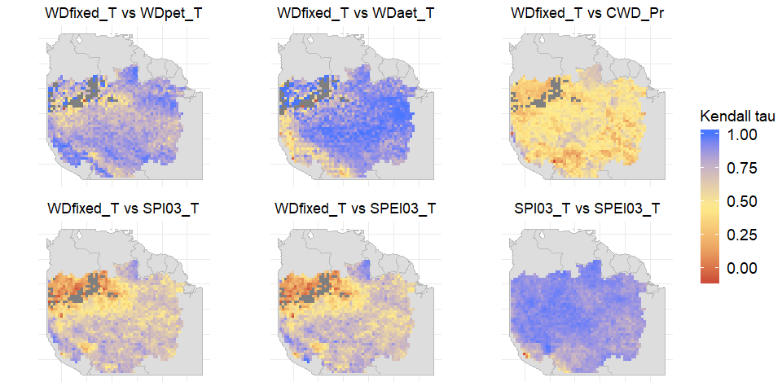

### Spatial correlation between same monthly MCWD time series computed with different data


```r
#Plotting of monthly anomalies of MCWD/SPEI/SPI computed with TRMM against those computed with CRU-------

#Plotting of monthly anomalies of MCWD/SPEI/SPI computed with TRMM against those computed with CRU-------

pl <- list()
SCPairsTrCru <- list(c("speiTrmm03", "speiCru03", "SPEI", period = 1999:2004),
                     c("cwd_preCru_petCru_r_monthlySd", "cwd_preTrmm_pet_r_monthlySd", "WDpet", period = 1999:2004),
                     c("cwd_preCru_aet_r_monthlySd", "cwd_preTrmm_aet_r_monthlySd", "WDaet", period = 1999:2004),
                     c("cwd_preCru_et100_r_monthlySd", "cwd_preTrmm_et100_r_monthlySd", "WDfixed", period = 1999:2004),
                     c("speiTrmm03", "speiCru03", "SPEI", period = c(1998, 2005)),
                     c("cwd_preCru_petCru_r_monthlySd", "cwd_preTrmm_pet_r_monthlySd", "WDpet", period = c(1998, 2005)),
                     c("cwd_preCru_aet_r_monthlySd", "cwd_preTrmm_aet_r_monthlySd", "WDaet", period = c(1998, 2005)),
                     c("cwd_preCru_et100_r_monthlySd", "cwd_preTrmm_et100_r_monthlySd", "WDfixed", period = c(1998, 2005)))

for (pairIndex in 1:length(SCPairsTrCru)) {
  var1 = SCPairsTrCru[[pairIndex]][1]
  var2 = SCPairsTrCru[[pairIndex]][2]
  title = SCPairsTrCru[[pairIndex]][3]
  period = SCPairsTrCru[[pairIndex]][4]
  
  ylabTitle <- ""
  if (pairIndex == 1) {
    ylabTitle = "1999:2004 correlation"
  } else if (pairIndex == 5) {
    ylabTitle = "1998 and 2005 correlation"
  }
  
  plot = spatialCorrelation(amazonWD, var1, var2, title, period, ylabTitle)
  pl[[pairIndex]] <- eval(substitute(plot))
}

do.call(ggarrange, c(plotlist = pl, nrow = 2, ncol = 4, common.legend = TRUE, legend = "right"))
```

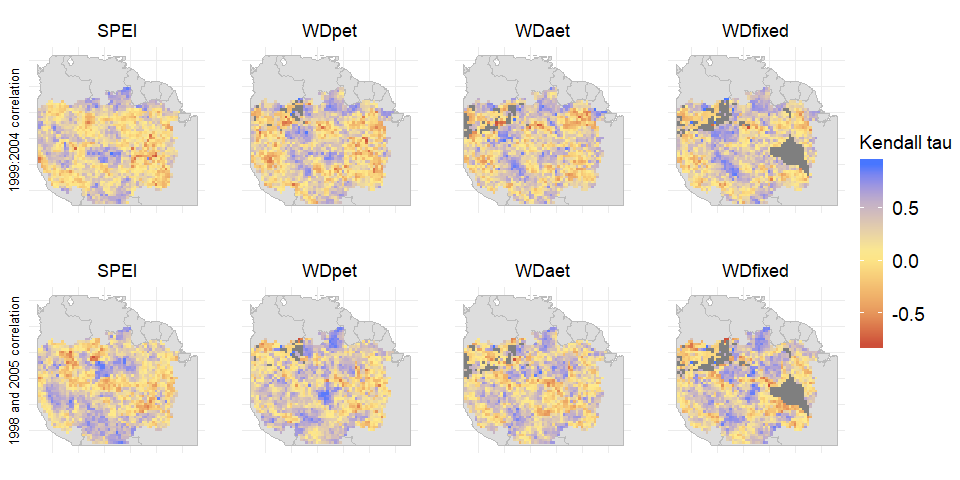

### Spatial correlation between annual MCWD time series computed with same data


```r
#Plotting of annual anomalies of MCWD computed with TRMM against each other------
#Plotting of annual anomalies of MCWD computed with TRMM against each other------
p <- list() #spatial correlation plots

pairsTrmm <- list(c("preTrmm_et100_r", "preTrmm_pet_r", "WDfixed_T vs WDpet_T"),
              c("preTrmm_et100_r", "preTrmm_aet_r", "WDfixed_T vs WDaet_T"),
              c("aet_pet_r", "preTrmm_et100_r", "WDfixed_T vs CWD_Pr"),
              c("preTrmm_et100_r", "preTrmm_petAvg_r", "WDfixed_T vs WDpet2_T"),
              c("preTrmm_et100_r", "preTrmm_aetAvg_r", "WDfixed_T vs WDaet2_T"),
              c("preTrmm_et100_r", "preTrmm_pet_nr", "WDfixed_T vs WDpet_T*"))

for (pairIndex in 1:length(pairsTrmm)) {
  var1 = pairsTrmm[[pairIndex]][1]
  var2 = pairsTrmm[[pairIndex]][2]
  title = pairsTrmm[[pairIndex]][3]
  
  plot = spatialCorrelation(anomaliesSd, var1, var2, title)
  p[[pairIndex]] <- eval(substitute(plot))
}

do.call(ggarrange, c(plotlist = p, nrow = 2, ncol = 3, common.legend = TRUE, legend = "right"))
```


### Spatial correlation between same annual MCWD time series computed with different data


```r
##Plotting of annual anomalies of MCWD computed with TRMM and CRU against each other------
pTrCr <- list()
pairsTrmmVsCru <- list(c("aet_pet_r", "aet_petCru_r", "CWD"),
                       c("preTrmm_aet_r", "preCru_aet_r", "WDaet"),
                       c("preTrmm_pet_r", "preCru_petCru_r", "WDpet"),
                       c("preTrmm_et100_r", "preCru_et100_r", "WDfixed"))

for (pairIndex in 1:length(pairsTrmmVsCru)) {
  var1 = pairsTrmmVsCru[[pairIndex]][1]
  var2 = pairsTrmmVsCru[[pairIndex]][2]
  title = pairsTrmmVsCru[[pairIndex]][3]
  
  plot = spatialCorrelation(anomaliesSd, var1, var2, title)
  pTrCr[[pairIndex]] <- eval(substitute(plot))
}

do.call(ggarrange, c(plotlist = pTrCr, nrow = 1, ncol = 4, common.legend = TRUE, legend = "right"))
```


## Annexes


```r
#Agreement map between WDfixed_T and WDfixed_C in regards to pixels below -50 mm annual deviation of MCWD
anomalies %>%
  filter(year == 2005) %>%
  select(lon, lat, year, preTrmm_et100_r, preCru_et100_r) %>%
  mutate(agreement = ifelse(preTrmm_et100_r < -50 & preCru_et100_r < -50, "Confirmed by both",
                            ifelse(preTrmm_et100_r < -50 | preCru_et100_r < -50, "Not confirmed",0))) %>%
  filter(agreement != 0) %>%
  mutate(agreement = factor(agreement, sort(unique(agreement), decreasing = FALSE))) %>%
  select(lon, lat, agreement) %>%
  regmap(region = "ama") +
  geom_tile(aes(fill = agreement)) +
  scale_fill_manual(values = c("firebrick1", "orange"), name = "Agreement") +
  ggtitle("Agreement map between WDfixed_T and WDfixed_C\nin regards to pixels below -50 mm annual MCWD deviation")+
  theme(title = element_text(size = 18),
        axis.title.x.bottom = element_text(size = 14),
        axis.title.y.left = element_text(size = 14))
```

```
## Warning: Removed 37 rows containing missing values (geom_tile).
```

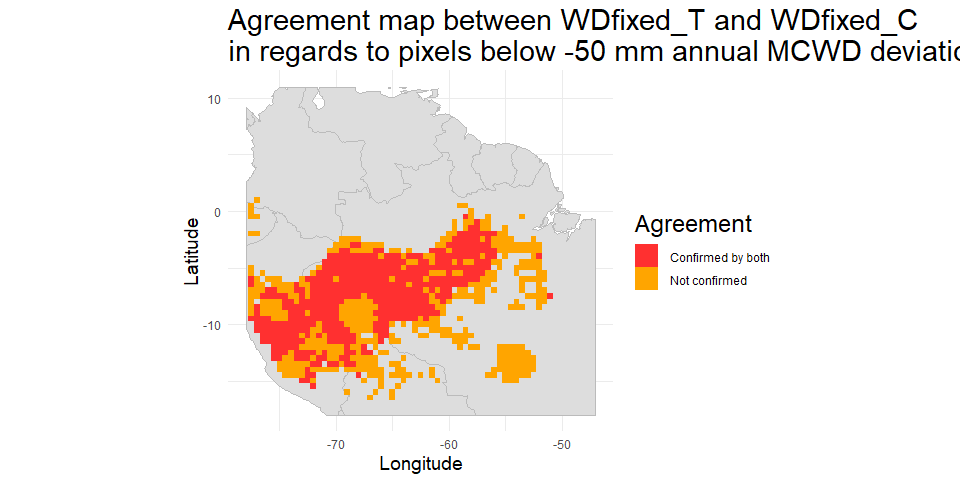<!-- -->

```r
#"Monthly values (rainfall and P) averaged over the whole Amazon basin (in mm)"
pre <- amazonWD %>%
  select(year, month, preTrmm, preCru) %>%
  mutate(date = dmy(paste("01/", month, "/", year, sep = ""))) %>%
  select(-year, -month) %>%
  group_by(date) %>%
  summarise("TRMM" = sum(preTrmm)/n(),
            "CRU" = sum(preCru)/n()) %>%
  gather(Precipitation, value, 2:3) %>%
  ggplot() +
  geom_line(aes(x = date, y = value, color = Precipitation), size = 2) +
  ggtitle("Monthly rainfall values averaged over the whole Amazon basin (in mm)")+
  theme(title = element_text(size = 18),
        axis.title.x.bottom = element_text(size = 14),
        axis.title.y.left = element_text(size = 14))
  
pet <- amazonWD %>%
  select(year, month, pet, petCru) %>%
  mutate(date = dmy(paste("01/", month, "/", year, sep = ""))) %>%
  select(-year, -month) %>%
  group_by(date) %>%
  summarise("Princeton University" = sum(pet)/n(),
            "CRU" = sum(petCru)/n()) %>%
  gather(PET, value, 2:3) %>%
  ggplot() +
  geom_line(aes(x = date, y = value, color = PET), size = 2) +
  ggtitle("Monthly PET values averaged over the whole Amazon basin (in mm)")+
  theme(title = element_text(size = 18),
        axis.title.x.bottom = element_text(size = 14),
        axis.title.y.left = element_text(size = 14))

ggarrange(pre, pet, nrow = 2)
```

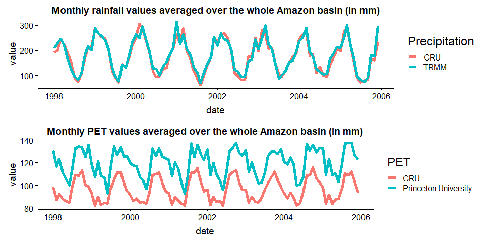<!-- -->
